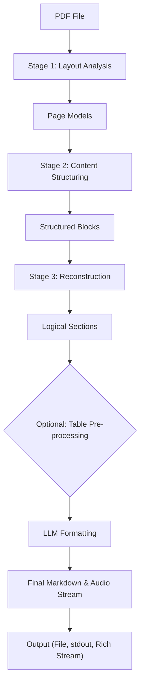
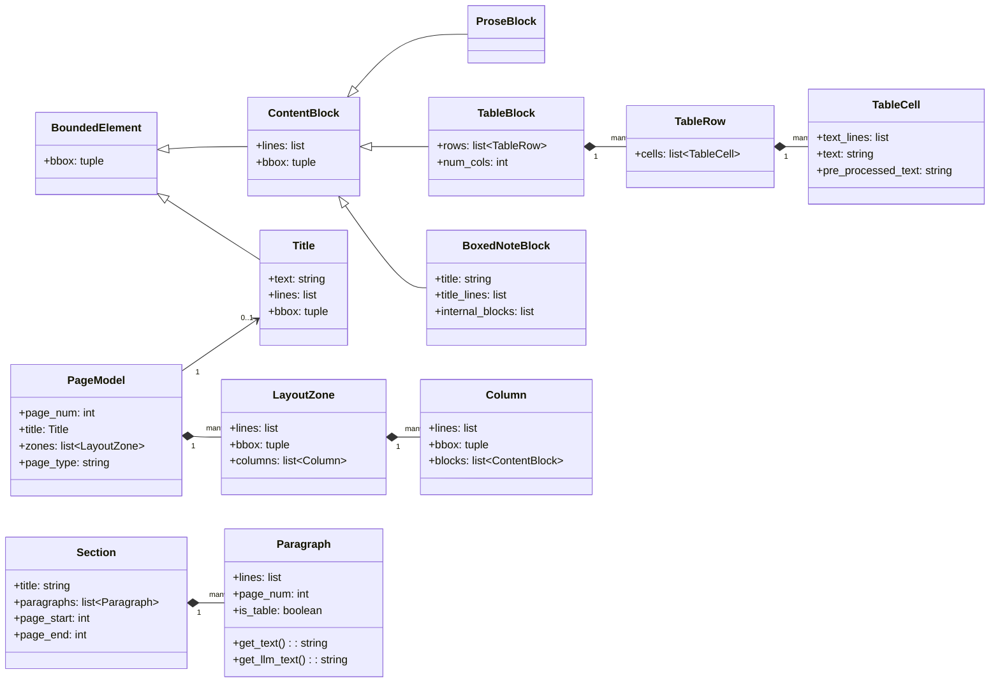
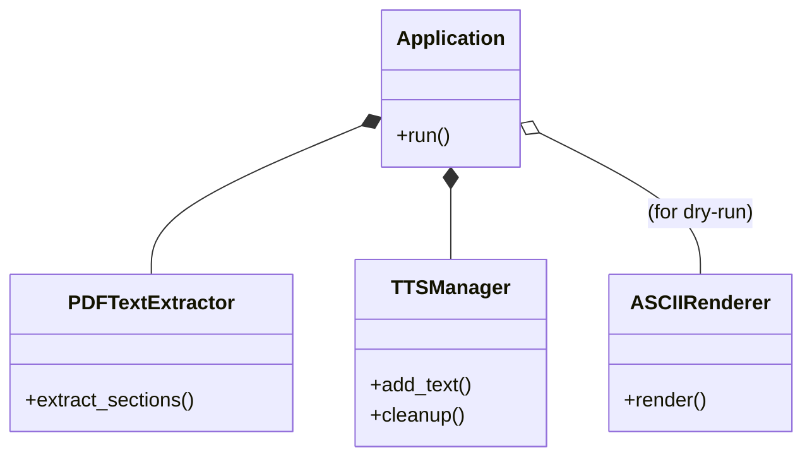

# ppdf: Advanced PDF Text and Structure Extraction Tool

`ppdf` is a powerful Python script designed for extracting, understanding, and
reformatting content from PDF files, especially those with complex, multi-column
layouts commonly found in RPG books. It goes beyond simple text extraction by
performing a multi-stage analysis to identify the document's logical structure,
then leverages a Large Language Model (LLM) via Ollama to produce clean, readable,
and stylistically enhanced Markdown.

## Overview

This script provides a comprehensive solution for extracting, understanding, and
reformatting content from PDF files, especially those with complex layouts like
multi-column RPG books. It goes beyond simple text extraction by performing a
multi-stage analysis to identify the document's logical structure.

The final, reconstructed text is then processed by a local Large Language Model
(LLM) via Ollama to produce a clean, readable, and stylistically enhanced
Markdown file.

## Features

* **Multi-Stage Analysis:** Identifies page layouts, columns, titles, paragraphs,
  tables, and boxed notes.

* **Logical Reconstruction:** Reorders content from columns into a correct,
  single-flow reading order.

* **LLM-Powered Formatting:** Uses an LLM to correct OCR/hyphenation errors
  and apply intelligent stylistic formatting (bold, italics).

* **Prompt Engineering Tools:** Allows for A/B testing of different system
  prompts using `--prompt-preset` and `--batch-presets`. Includes an
  `--analyze-prompts` mode to have the LLM critique your prompts.

* **Table Summarization:** An optional mode (`tts` preset) can generate
  natural-language descriptions of a table's purpose, making content more
  accessible.

* **Real-time Audio Streaming:** When using `--speak`, the LLM's response is
  converted to speech and played back live as it's being generated.

* **Performance Epilogue:** In verbose mode, provides detailed statistics on
  execution time, processing speed, and token counts retrieved directly from
  the Ollama API.

* **Topical Debugging:** Allows fine-grained debug logging for specific parts
  of the pipeline (e.g., 'layout', 'llm', 'tts', 'tables').

* **Rich Terminal Output:** Can render the final Markdown in real-time
  directly in the terminal using the `rich` library.

* **Multiple Output Modes:** Can save to a file, print to stdout, or convert
  to speech.

## Installation

This script requires several external Python libraries. Core dependencies can be
installed with:

```bash
pip install pdfminer.six requests rich
```

To enable the optional (and recommended) offline speech feature, also install:

```bash
pip install "piper-tts==1.3.0" pyaudio
```

## Examples

Here are various ways to use the `ppdf` script:

* **Basic Usage - Process a PDF and save to Markdown:**
    ```bash
    python ppdf.py my_document.pdf -o my_document.md
    ```

* **Process specific pages (e.g., pages 1, 3, and 5 through 7):**
    ```bash
    python ppdf.py complex_layout.pdf -p "1,3,5-7" -o output_pages.md
    ```

* **Force a two-column layout detection (useful for consistent documents):**
    ```bash
    python ppdf.py rpg_book.pdf -C 2 -o rpg_output.md
    ```

* **Preserve original bold/italic formatting from the PDF:**
    ```bash
    python ppdf.py styled_doc.pdf -K -o styled_output.md
    ```

* **Use a different Ollama model (e.g., `mistral`):**
    ```bash
    python ppdf.py document.pdf -M mistral -o mistral_output.md
    ```

* **Run a "dry run" to only analyze the structure without LLM processing:**
    ```bash
    python ppdf.py document.pdf -D
    ```

* **Enable verbose logging for detailed progress messages:**
    ```bash
    python ppdf.py document.pdf -v -o verbose_output.md
    ```

* **Enable debug logging for all topics with colored output:**
    ```bash
    python ppdf.py document.pdf -d all --color-logs
    ```

* **Save the raw, extracted text before LLM processing:**
    ```bash
    python ppdf.py document.pdf -e raw_text.txt -o final_output.md
    ```
* **Stream the output as speech in real-time (English):**
    ```bash
    python ppdf.py document.pdf -S en
    ```

## Processing Pipeline

The script processes the PDF in a series of stages. The high-level flow transforms
the raw file into structured, readable output.



### Detailed Breakdown: Page to Content Blocks

The diagram below offers a more detailed look at the crucial first stages,
showing how a single page's physical layout is analyzed and segmented into logical
chunks. These chunks are then converted into structured objects (like `Title`,
`TableBlock`, or `ProseBlock`). Finally, the reconstruction phase iterates through
these typed blocks to build the final, logical `Section` objects that make up the
document.

```
[ LTPage Layout Object from PDFMiner ]
             |
             v
+---------------------------------+  <-- [Function: _analyze_single_page_layout]
|         PAGE MODEL N            |
|---------------------------------|
|  Zone 1 (y: Y1 -> Y2)           |  <-- A page is split into vertical zones.
|                                 |
|  +-----------+ +------------+   |
|  | Column 1  | | Column 2   |   |  <-- Each zone is split into columns.
|  | (bbox)    | | (bbox)     |   |      A bounding box is computed for each.
|  +-----------+ +------------+   |
+---------------------------------+
             |
             +---------------------> To a specific Column Processor
             |
+---------------------------------+  <-- [Function: _segment_column_into_blocks]
|       COLUMN'S LINES            |
|---------------------------------|
|  - Title: "SECTION TITLE"       |
|  - Hdr: "TABLE HEADER"          |  <-- Finds "separators" to define boundaries.
|  - ... (table content) ...      |
|  - Title: "NEXT SECTION TITLE"  |
+---------------------------------+
             |
             v
+---------------------------------+  <-- [Function: _segment_prose_and_tables]
| CHUNK 1: "SECTION TITLE" (Title)|
|---------------------------------|
| CHUNK 2: "TABLE HEADER" -> ...  |  <-- Creates bounded chunks of lines.
|---------------------------------|
| CHUNK 3: "NEXT TITLE..." (Title)|
+---------------------------------+
             |
             v
+---------------------------------+  <-- Chunks are instantiated as typed objects.
| Structured Blocks:              |
|  - Title(text="...")            |
|  - TableBlock(...)              |
|  - Title(text="...")            |
+---------------------------------+
             |
             v
+---------------------------------+  <-- [Function: _build_sections_from_models]
|     LOGICAL RECONSTRUCTION      |
|---------------------------------|
| Find Title block ->             |
|   Start new Section(...)        |  <-- Assembles blocks into logical sections
| Find TableBlock ->              |      containing paragraphs.
|   Add Paragraph to Section      |
+---------------------------------+
             |
             v
[ Final list of Section objects ]
```

## Data Model Classes

`ppdf` employs a sophisticated, hierarchical data model to represent the PDF's
content, transforming raw layout elements into logically structured sections. This
model is crucial for accurately understanding and reconstructing the document's
flow. The diagram below illustrates the relationships.



### `BoundedElement`

The base class for any layout element that has a computed bounding box.

### `ContentBlock`

A generic block of content lines from the PDF. It serves as a base for more
specific content types and holds the raw line objects and bounding box.

### `ProseBlock`

Represents a block of content identified as standard prose text.

### `TableCell`

Represents a single cell within a table. It has methods to retrieve raw and
pre-processed text.

### `TableRow`

Represents a single row in a table, composed of multiple `TableCell` objects.

### `TableBlock`

A structured representation of an entire table, containing `TableRow` objects.

### `BoxedNoteBlock`

Represents content enclosed within a graphical box (e.g., a sidebar). It has its
own title and can contain other `ContentBlock` objects like `ProseBlock` or
`TableBlock`.

### `Title`

Represents a title or heading element found on a page or within a column.

### `Column`

Represents a single vertical column of text on a page, containing a list of
`ContentBlock` objects.

### `LayoutZone`

Represents a vertical region of a page that has a consistent column layout. A page
can have multiple zones.

### `PageModel`

A structured representation of a single PDF page's physical layout, including its
zones, columns, and detected elements.

### `Paragraph`

Represents a logical paragraph of text, reconstructed from various `ContentBlock`
types. This is the unit used for LLM processing.

### `Section`

Represents a logical section of a document, such as a chapter or topic, composed
of multiple `Paragraph` objects.

## Auxiliary Classes

The application is orchestrated by a set of high-level manager and utility
classes.



## Command-Line Help Output

```
usage: ppdf.py [-h] [-p PAGES] [-C COUNT] [--no-remove-footers] [-K] [--no-fmt-titles] [-M MODEL]
               [-U URL] [-z SIZE] [-t TEMPERATURE]
               [--prompt-preset {auto,creative,creative-v1,creative-v2,strict,tts} | --batch-presets [PREFIX]]
               [-o [FILE]] [-e [FILE]] [--rich-stream] [--color-logs] [-S [{en,es,ca}]] [-D]
               [--analyze-prompts] [-v] [-d [TOPICS]]
               pdf_file

An advanced PDF text and structure extraction tool.

Main Options:
  pdf_file              Path to the input PDF file.
  -h, --help            Show this help message and exit.

Processing Control:
  -p PAGES, --pages PAGES
                        Pages to process (e.g., '1,3,5-7'). (default: all)
  -C COUNT, --columns COUNT
                        Force column count (e.g., '2', 'auto'). (default: auto)
  --no-remove-footers   Disable footer removal logic. (default: Enabled)
  -K, --keep-style      Preserve bold/italic formatting from PDF. (default: False)
  --no-fmt-titles       Disable automatic uppercasing of section titles. (default: False)

LLM Configuration:
  -M MODEL, --model MODEL
                        Ollama model to use. (default: llama3.1:latest)
  -U URL, --url URL     Ollama API URL. (default: http://localhost:11434)
  -z SIZE, --chunk-size SIZE
                        Max characters per LLM chunk. (default: 4000)
  -t TEMPERATURE, --temperature TEMPERATURE
                        Set the model's temperature. (default: 0.2)
  --prompt-preset {auto,creative,creative-v1,creative-v2,strict,tts}
                        System prompt preset to use. (default: auto)
  --batch-presets [PREFIX]
                        Run all presets, or only those with a specific prefix.

Script Output & Actions:
  -o [FILE], --output-file [FILE]
                        Save final output. Defaults to PDF name.
  -e [FILE], --extracted-file [FILE]
                        Save raw extracted text. Defaults to PDF name.
  --rich-stream         Render live LLM output as Markdown in terminal. (default: False)
  --color-logs          Enable colored logging output. (default: False)
  -S [{en,es,ca}], --speak [{en,es,ca}]
                        Stream output to speech (en, es, ca).
  -D, --dry-run         Analyze structure without calling LLM. (default: False)
  --analyze-prompts     Enable Stage 0 to have the LLM analyze the selected presets. (default: False)
  -v, --verbose         Enable INFO logging for detailed progress. (default: False)
  -d [TOPICS], --debug [TOPICS]
                        Enable DEBUG logging (all,layout,struct,llm,tts,tables).
```

## License

This project is licensed under the MIT License - see the `LICENSE` file for details.
